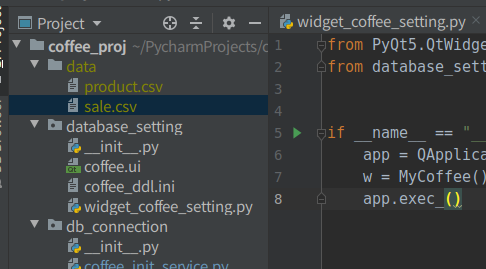

Ubuntu Linux

SHOW VARIABLES LIKE "secure_file_priv";

/*
확인후 추가
[mysqld]
secure_file_priv=""
*/

원하는 경로에 (Errcode: 13 - Permission denied) 해결책

https://dreamlog.tistory.com/563

/etc/apparmor.d/usr.sbin.mysqld를 편집

추가

    # Allow data files dir access

    /var/lib/mysql-files/ r,
    /var/lib/mysql-files/** rwk,

    /home/work/PycharmProjects/coffee_proj/data/ r,
    /home/work/PycharmProjects/coffee_proj/data/** rwk,

/etc/init.d/apparmor restart

MySQL 재실행 후 외부 파일 읽기가 정상동작하는 것을 확인
